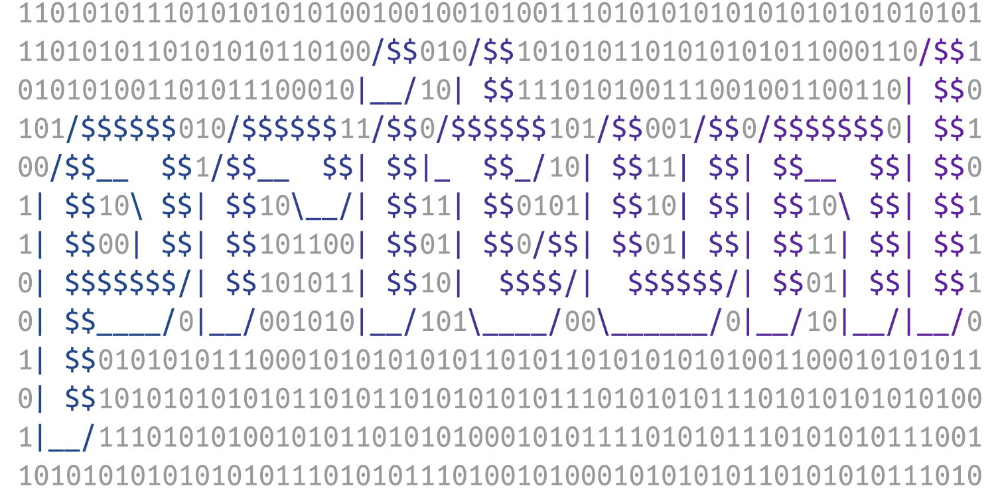

# synq: rust based clipboard and scroll sharing

[](https://github.com/pritunl)
[](https://twitter.com/pritunl)
[](https://pritunl.substack.com/)
[](https://forum.pritunl.com)

[Synq](https://github.com/pritunl/synq) is a Rust based clipboard and scroll
event sharing tool. Clipboard sharing supports Wayland and X11 with multiple
clients. Clipboard traffic is encrypted and signed with NaCl over gRPC.

High definition scroll event sharing is supported between the host and QEMU
guests. This allows using modern touchpads with high definition scroll events
inside QEMU. Multiple guests are supported by using QEMU virtual device scroll
events to detect the active guest. Scroll events are streamed unencrypted from
the host over gRPC and replayed on the guest.

[](https://github.com/pritunl/synq)

## Install from Source

```bash
sudo dnf -y install rust cargo rust-std-static systemd-devel libinput-devel

cargo install synq

# Install without scroll support
sudo install -m 0755 "$HOME/.cargo/bin/synq" /usr/bin/synq

# Install with scroll support
sudo install -m 4755 "$HOME/.cargo/bin/synq" /usr/bin/synq
```

The binary is installed setuid root to allow scroll sharing, which requires
access to `/dev/input` and `/dev/uinput`. If only clipboard sharing is needed
the binary can be installed without setuid.

## Configure

Run the interactive configuration on each host:

```bash
synq configure
```

The configuration tool will prompt for a broadcast interface and hostname,
then broadcast on the local network to discover other hosts running
`synq configure`. Discovered hosts are prompted for automatically with the
public key exchanged over the network. Hosts that cannot be discovered by
broadcast can be added manually by entering the address. Scroll options are
skipped when not running as root, use `synq configure --scroll` to override.

The configuration is stored in `~/.config/synq.conf`:

```yaml
server:
  bind: "[::]:8548"
  address: desktop.example.com
  private_key: <base64 private key>
  public_key: <base64 public key>
  clipboard_source: true
  clipboard_destination: true
  scroll_source: false
  scroll_destination: true
  scroll_input_devices:
    - name: QEMU Virtio Tablet
      scroll_reverse: true
      scroll_modifier: 1.0
peers:
  - address: laptop.example.com:8548
    public_key: <base64 peer public key>
    clipboard_source: true
    clipboard_destination: true
    scroll_source: true
    scroll_destination: false
```

### Server options

| Option | Description |
| --- | --- |
| `bind` | Address and port for the gRPC server, default `[::]:8548` |
| `address` | Hostname other peers use to reach this system |
| `private_key` | NaCl private key, generated automatically |
| `public_key` | NaCl public key, shared with peers |
| `clipboard_source` | Send clipboard changes to peers |
| `clipboard_destination` | Apply clipboard changes received from peers |
| `scroll_source` | Capture and send scroll events, typically the host |
| `scroll_destination` | Replay scroll events received from peers, typically the QEMU guest |
| `scroll_input_devices` | Input devices to capture on a source or block on a destination |

### Scroll device options

| Option | Description |
| --- | --- |
| `name` | Match device by name from `synq list-devices` |
| `path` | Match device by path such as `/dev/input/event5` |
| `scroll_reverse` | Reverse the scroll direction, default `true` |
| `scroll_modifier` | Multiplier applied to scroll speed, default `1.0` |

### Peer options

Each peer has the same clipboard and scroll options as the server section,
applied per peer. A peer with `clipboard_source: true` is a peer this system
accepts clipboard changes from, and `clipboard_destination: true` is a peer
this system sends clipboard changes to.

## Commands

| Command | Description |
| --- | --- |
| `synq daemon` | Run the sharing daemon |
| `synq configure` | Interactive configuration with host discovery |
| `synq list-devices` | List available input devices |
| `synq detect-devices` | Detect scroll devices by scrolling on them |
| `synq generate-key` | Generate a new keypair and print the public key |

Use `synq --debug <command>` to enable debug output.

## Systemd Service

```bash
mkdir -p ~/.config/systemd/user/
tee ~/.config/systemd/user/synq.service << EOF
[Unit]
Description=Synq Daemon
After=graphical-session.target

[Service]
Type=simple
ExecStart=/usr/bin/synq daemon
Restart=on-failure
RestartSec=3

[Install]
WantedBy=default.target
EOF

systemctl --user daemon-reload
systemctl --user enable --now synq.service

# View logs
journalctl --user-unit synq.service
```

## Security

Clipboard traffic is encrypted and authenticated with NaCl box using the
keypairs in the configuration, only peers listed in the configuration with a
matching public key are accepted. Scroll events are not encrypted and only
contain scroll axis deltas. The gRPC port should still be restricted to
trusted networks with a firewall.

## License

Please refer to the [`LICENSE`](LICENSE) file for a copy of the license.
